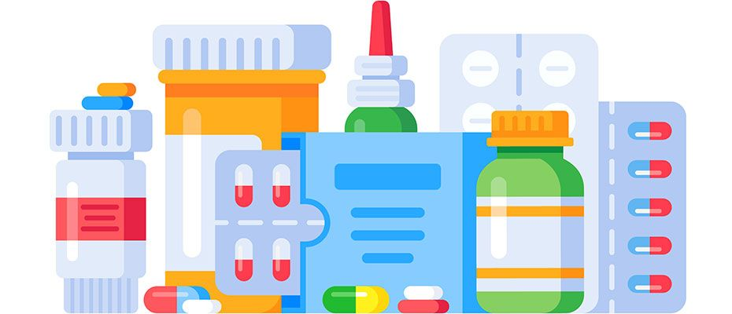
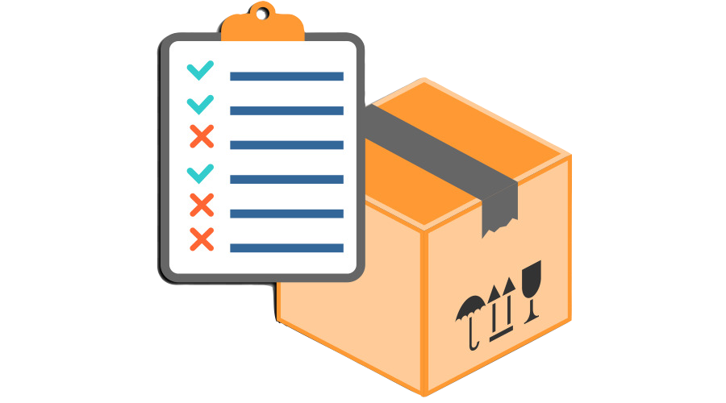
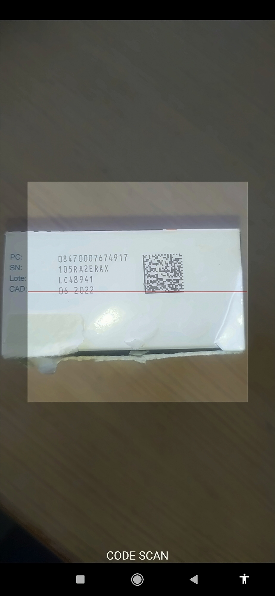

# 💊 MyPharmaMemoryMVC para Android


## 📱 Descripción General

**MyPharmaMemoryMVC** es una aplicación Android desarrollada en Kotlin que permite a los usuarios gestionar su inventario personal de medicamentos. La app destaca por su capacidad para leer el código de barras de los medicamentos y obtener información detallada de la API REST oficial de CIMA (Agencia Española de Medicamentos y Productos Sanitarios).

---

## 🚀 Características principales

- 📷 **Lector de códigos de barras**: Escanea el código de barras (Data Matrix) de los medicamentos para identificarlos rápidamente.
- 🌐 **Integración con API CIMA**: Consulta en tiempo real la información oficial de medicamentos mediante la API REST de CIMA.
- 🗃️ **Inventario personal**: Permite almacenar, listar y consultar tus medicamentos, con detalles como nombre, código nacional, fecha de caducidad, vía de administración y dolencias tratadas.
- 🔒 **Autenticación**: Acceso seguro mediante email y contraseña usando Firebase Authentication.
- ☁️ **Sincronización en la nube**: Los datos de tus medicamentos se almacenan en Firebase Firestore, accesibles desde cualquier dispositivo autenticado.
- 🖼️ **Interfaz intuitiva y visual**: Uso de iconos, imágenes y colores para una experiencia de usuario agradable.

---

## 🏗️ Arquitectura del Proyecto

El proyecto sigue el patrón **MVC (Modelo-Vista-Controlador)**:

- **Modelo (`model/`)**: Clases de datos (`PharmacoModel`, `PharmaResponse`), lógica de acceso a datos y servicios (`Repository`, `APIService`).
- **Vista (`view/`)**: Fragments para pantallas informativas y de contacto.
- **Controlador (`controller/`)**: Fragments y actividades que gestionan la lógica de interacción y navegación (`MainActivity`, `LoginFragment`, `CodeLectorFragment`, etc.).

```
app/
└── src/
    └── main/
        ├── java/com/juandomingo/mypharmamemorymvc/
        │   ├── model/
        │   ├── view/
        │   └── controller/
        └── res/
            ├── layout/
            ├── drawable/
            └── values/
```

---

## 🧩 Dependencias principales

- [Kotlin](https://kotlinlang.org/) 🟣
- [AndroidX](https://developer.android.com/jetpack/androidx) 📦
- [ZXing](https://github.com/journeyapps/zxing-android-embedded) para escaneo de códigos de barras 📷
- [Retrofit](https://square.github.io/retrofit/) para llamadas HTTP 🌐
- [Gson](https://github.com/google/gson) para parseo JSON 🗃️
- [Firebase Auth & Firestore](https://firebase.google.com/) 🔥

---

## 🖼️ Pantallas principales

### 🔑 Login

- Acceso mediante email y contraseña.
- Registro y cierre de sesión.

### 🏠 Home (Mis Fármacos)

- Visualiza tu inventario de medicamentos.
- Acceso a introducir nuevo fármaco o ver la lista completa.

### ➕ Introducir nuevo fármaco

- Formulario para añadir manualmente un medicamento.

### 📋 Lista de medicamentos

- Visualiza todos tus medicamentos almacenados.

### 📷 Lector de código de barras

- Escanea el código de barras del medicamento para obtener información automáticamente.

### 🌐 Información CIMA

- Visualiza el prospecto y detalles oficiales del medicamento desde la API CIMA.

---

## 🔄 Flujo de uso

1. **Registro/Login** 🔑
2. **Escanear medicamento** o **añadir manualmente** ➕
3. **Consultar información oficial** (API CIMA) 🌐
4. **Almacenar en tu inventario** 🗃️
5. **Consultar, editar o eliminar medicamentos** desde la lista 📋

---

## ⚙️ Instalación y ejecución

1. Clona el repositorio:
   ```bash
   git clone <URL-del-repo>
   ```
2. Abre el proyecto en Android Studio.
3. Configura tu archivo `google-services.json` para Firebase (ya incluido de ejemplo).
4. Compila y ejecuta en un dispositivo físico (recomendado para el escaneo de códigos de barras).

---

## 🔗 API REST CIMA
- Documentación oficial: https://cima.aemps.es/cima/rest/docs
- Ejemplo de endpoint usado:
  ```
  https://cima.aemps.es/cima/rest/medicamento?nregistro=<codigo>
  ```

---

## 🛡️ Seguridad y privacidad
- Los datos personales y de medicamentos se almacenan de forma segura en Firebase.
- No se comparten datos con terceros.

---

## 👨‍💻 Autor
- Juan Domingo
- [GitHub](https://github.com/juandomingoortin)

---

## 📄 Licencia
Este proyecto está bajo la Licencia MIT.

---

## ⭐ ¡Contribuciones bienvenidas!
Si quieres mejorar la app, ¡no dudes en hacer un fork y enviar tu pull request! 